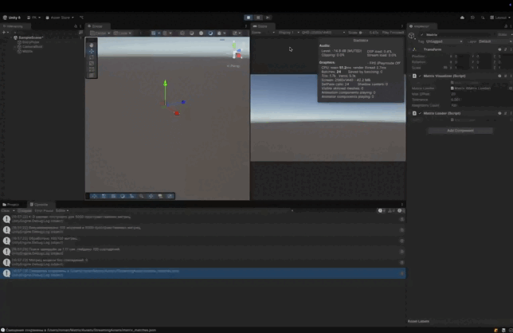

# Визуализация матриц в Unity

## Описание

Этот проект для Unity загружает матрицы из JSON, отображает их в сцене и анализирует совпадения. Для быстрого поиска используется KD-дерево, а пул объектов помогает оптимизировать создание и управление сущностями.

## Возможности

- **Загрузка матриц**: Чтение данных о матрицах из JSON-файлов.
- **Визуализация матриц**: Отображение загруженных матриц в сцене Unity.
- **Оптимизация с помощью KD-дерева**: Эффективный поиск ближайших соседей.
- **Пул объектов**: Повторное использование игровых объектов для оптимизации производительности.
- **Сохранение совпадений**: Найденные пересечения матриц сохраняются в JSON-файл по пути `/Users/roman/Matrix/Assets/StreamingAssets/matrix_matches.json`.

## Демонстрация

## Структура кода

### Управление матрицами

- **`MatrixLoader`**: Загружает данные матриц из JSON-файлов.
- **`MatrixVisualizer`**: Визуализирует и сравнивает матрицы, подсвечивая совпадения.

### Обработка пространственных данных

- **`KDTree`**: Реализует KD-дерево для поиска ближайших соседей.

### Управление объектами

- **`CustomPool<T>`**: Реализует пул объектов для оптимизации создания экземпляров.
- **`EntitySpawnFactory`**: Управляет созданием и размещением объектов.

### Управление ресурсами

- **`AssetProvider`**: Загружает префабы и игровые объекты из `Resources`.

## Используемые паттерны

- **`Service Locator`**: `AllServices` используется как локатор сервисов для управления зависимостями.
- **`Dependency Injection (DI)`**: Используется для внедрения зависимостей в `EntryPoint` и другие классы.
- **`Object Pooling`**: Реализован в `CustomPool<T>` для повторного использования объектов и оптимизации памяти.
- **`Factory Method`**: `EntitySpawnFactory` управляет созданием сущностей и их размещением.
- **`Strategy`**: `KDTree` использует разные стратегии поиска (поиск ближайшего соседа, k-ближайших соседей).

## Возможные улучшения

- Реализация динамической загрузки матриц.
- Если количество объектов значительно увеличится, можно использовать **Jobs**, но в текущей реализации это кажется лишним. Если потребуется, можно добавить.
- Вместо спавна объектов можно отрисовывать кубы через **Shader**, что позволит отрисовать их за **1 draw call** и значительно повысить производительность.

